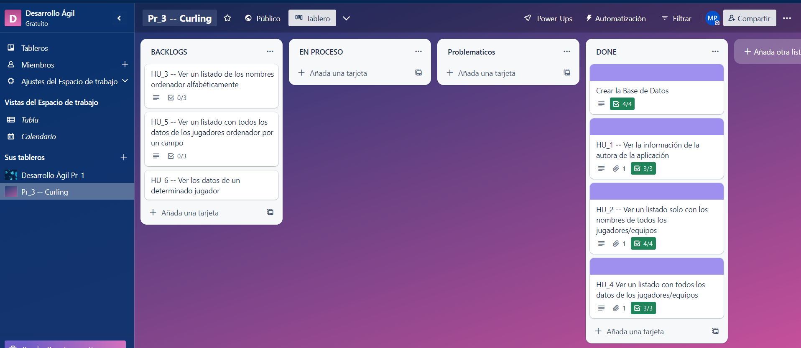
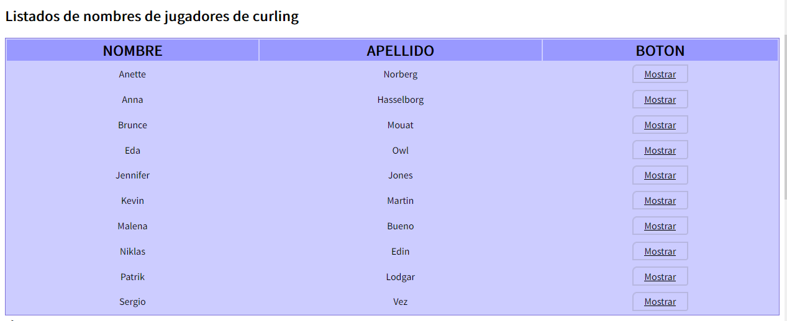

[](https://classroom.github.com/online_ide?assignment_repo_id=10572243&assignment_repo_type=AssignmentRepo)
# DATOS DEL ALUMNO 
* NOMBRE: Magdalena Bueno Pedrera
* APELLIDOS: Bueno Pedrera
* GMAIL: mmbp0003@red.ujaen.es
* TRELLO:  [Enlace al tablero de Trello](https://trello.com/b/roYWsfVg/pr3-curling) ↗️
* FAUNA:  [Enlace al tablero de Fauna](https://dashboard.fauna.com/collections/Curling/@db/eu/Curling-mmbp0003) ↗️
#Base de datos de mi programa

En primer lugar voy a presentar la base de datos que va a conformar mi trabajo sobre el curling.
Para ello voy a dejar los documentos correspondiente de cada uno de los jugadores y las capturas correspondientes a esta nueva base de datos.


*Captura de Fauna antes de realizar los documentos.* &#8593;


*Captura de los diez documentos creados.* &#8593;

##Primer documento

```
{
"nombre_jugador": {
"nombre": "Sergio",
"apellido": "Vez"
},
"fecha_nacimiento": {
"dia": 13,
"mes": 5,
"año": 1994
},
"participacion_juegos_olimpicos": [2014, 2018, 2009],
"equipo": "equipo masculino español",
"categorias_jugadas": "Mixto",
"victorias": 2,
"derrotas": 1
}

```

##Segundo documento
```
{
  nombre_jugador: {
    nombre: "Kevin",
    apellido: "Martin"
  },
  fecha_nacimiento: {
    dia: 31,
    mes: 7,
    año: 1966
  },
  participacion_juegos_olimpicos: [2002, 2010, 1991, 2008],
  equipo: "equipo masculino canadiense",
  categorias_jugadas: "masculino",
  victorias: 2,
  derrotas: 2
}
```

##Tercer documento
```
{
  nombre_jugador: {
    nombre: "Jennifer",
    apellido: "Jones"
  },
  fecha_nacimiento: {
    dia: 7,
    mes: 7,
    año: 1974
  },
  participacion_juegos_olimpicos: [2014, 1008, 2015, 2018],
  equipo: "equipo femeino canadiense",
  categorias_jugadas: "Mixtos",
  victorias: 3,
  derrotas: 1
}

```

##Cuarto documento
```
{
  nombre_jugador: {
    nombre: "Anette",
    apellido: "Norberg"
  },
  fecha_nacimiento: {
    dia: 12,
    mes: 11,
    año: 1996
  },
  participacion_juegos_olimpicos: [2006, 2010],
  equipo: "equipo femenino canadiense",
  categorias_jugadas: "femeninos",
  victorias: 2,
  derrotas: 0
}
```

##Quinto documento
```
{
  nombre_jugador: {
    nombre: "Anna",
    apellido: "Hasselborg"
  },
  fecha_nacimiento: {
    dia: 4,
    mes: 9,
    año: 1989
  },
  participacion_juegos_olimpicos: [2018, 2022],
  equipo: "equipo femenino canadiense",
  categorias_jugadas: "Dobles",
  victorias: 0,
  derrotas: 2
}
```

##Sexto documento
```
{
  nombre_jugador: {
    nombre: "Niklas",
    apellido: "Edin"
  },
  fecha_nacimiento: {
    dia: 25,
    mes: 2,
    año: 1985
  },
  participacion_juegos_olimpicos: [2014, 2018, 2022],
  equipo: "equipo masculino canadiense",
  categorias_jugadas: "masculinos",
  victorias: 1,
  derrotas: 2
}
```

##Septimmo documento
```
{
  nombre_jugador: {
    nombre: "Patrik",
    apellido: "Lodgar"
  },
  fecha_nacimiento: {
    dia: 18,
    mes: 6,
    año: 1960
  },
  participacion_juegos_olimpicos: [1998],
  equipo: "equipo masculino suizo",
  categorias_jugadas: "Mixtos",
  victorias: 1,
  derrotas: 0
}
```

##Octavo documento
```
{
  nombre_jugador: {
    nombre: "Brunce",
    apellido: "Mouat"
  },
  fecha_nacimiento: {
    dia: 30,
    mes: 4,
    año: 1979
  },
  participacion_juegos_olimpicos: [1999, 2004],
  equipo: "equipo masculino britanico",
  categorias_jugadas: "Dobles",
  victorias: 1,
  derrotas: 1
}
```

##Noveno documennto
```
{
  nombre_jugador: {
    nombre: "Malena",
    apellido: "Bueno"
  },
  fecha_nacimiento: {
    dia: 19,
    mes: 5,
    año: 1995
  },
  participacion_juegos_olimpicos: [2009, 2018, 2022],
  equipo: "equipo femenino español",
  categorias_jugadas: "femeninos",
  victorias: 2,
  derrotas: 1
}
```

##Decimo documento
```
{
  nombre_jugador: {
    nombre: "Eda",
    apellido: "Owl"
  },
  fecha_nacimiento: {
    dia: 18,
    mes: 1,
    año: 1978
  },
  participacion_juegos_olimpicos: [1997, 1999],
  equipo: "equipo femenino americano",
  categorias_jugadas: "femeninos",
  victorias: 0,
  derrotas: 2
}
```

#Primer incremento (Inicio)

Antes de este incremento he seleccionado en primer lugar un conjuntos de Historias de Usuario, que serán las que conformen el 
primer incremento de nuestro programa; es decir, el primer commit que realizaremos.


Con esto señalado, podemos comenzar a programar la primera historia de usuario de nuestro programa.

##Primera Historia de Usuario

En esta primera historia de usuario hemos trabajado con dos archivos "ms-plantilla\callbacks.js" y "ms-plantilla.js".
En la primera de ellas, modificaremos la clase de AcercaDe y en la segunda miraremos las comprobaciones que ha realizado con TDD

```
acercaDe: async (req, res) => {
        try {
            CORS(res).status(200).json({
                mensaje: "Microservicio MS Plantilla: acerca de",
                autor: "Magdalena Bueno Pedrera",
                email: "mmbp0003@red.ujaen.es",
                fecha: "19/01/2001"
            });
        } catch (error) {
            CORS(res).status(500).json({ error: error.description })
        }
    },
```
*callback.js modificado.* &#8593;

Mientras que, las comprobaciones que se nos indica con TDD serán 3 de ellas; cuando se le pasa un objeto que no tiene los campos correspondientes,
cuando se muestras valores que no son un objeto y cuando se le pasa un valor nulo.


##Segunda Historia de Usuario

En la segunda historia de usuario se nos pide poder ver un listado con los nombres de los jugadores que se han incluido
en la base de datos de Fauna. Para ellos he tenido que modificar las siguientes clases:

 > ms-plantilla.js 
 
Dentro de esta clase hemos introducido las siguiente clases

```
 TablaNombres.CabeceraJugadores
 TablaNombres.CuerpoJugadores
 TablaNombres.pie
```

Estas funciones son las que generan la tabla donde veremos listados los nombres de todos los jugadores introducidos en 
nuestra base de datos

```
    Plantilla.recupera
```

Es la función que recupera los parámetros del nombre y apellidos de los jugadores de la base de datos y los devuelve con 
callBackFn

```
    Plantilla.listarNombresCurling
```
Es la función a la que llama desde el index, para que se listen desde los jugadores por pantalla con la función recupera 
y Nombres_Jugadores

```
    Plantilla.Nombres_Jugadores
    Plantilla.SustituyeTags
    Plantilla.actualiza
```
Se une la tabla que hemos creado y se introducen en ella los parámetros sustituyendo y actualizando los tags del nombre 
y apellido
Por otra parte también hemos cambiado las clases de:

```
    ms-plantilla\routers.js
    ms-plantilla\callback.js
```
Las clases que se han añadido en los callbacks son:
```
    getTodos
    getId 
```
Las clases que se han añadido a la clase routers son:
```
    router.get("/getTodos")
    router.get("/getId")
```

Por otra parte hemos creado los TDD de la clase de NombresJugadores en la clase "ms-plantilla-spec.js" donde hemos hecho 
dos pruebas:

- Una donde se muestran los datos del vector nulo
- La segunda muestra los datos nulos cuando el objeto que se le pasa no es el correcto


*Trello al comenzar la HU.* &#8593;


*Trello al acabar la HU.* &#8593;


##CUARTA HISTORIA DE USUARIO

En esta historia de usuario se nos pide un listado donde aparezca en esta ocasión todos los datos de los jugadores de la 
base de datos que hemos creado y se vean en una tabla, al ser muy parecido a la anterior historia de usuario, voy a dar 
menos detalle sobre esta.

Las clases que hemos introducido son

```
    ms-plantilaa
         > TablaCompleta
         > TablaCompleta.CabeceraCompleta
         > TablaCompleta.CuerpoCompleto
         > TablaCompleta.PieC
         
         > Plantilla.sustituyeTagsCompletos
         > Plantilla.TablaCompleta.actualiza_2
         > Plantilla.TablaCompletaJugadores
         
         > Plantilla.listadoCompleto
```

Viendo estas clases, las funcionalidad son las mismas en la historia de usuario pasada; mientras que, los test de esta 
también serás los mismos que en la anterior.


*Trello al comenzar la HU.* &#8593;


*Trello al acabar la HU.* &#8593;


#PRIMERA ITERACIÓN


*Trello al comienzo de la iteración 1.* &#8593;


*Trello al finalizar la iteración 1 .* &#8593;

#SEGUNDA ITERACIÓN


*Trello al comienzo de la iteración 1.* &#8593;


*Trello al finalizar la iteración 1 .* &#8593;

##TERCERA HISTORIA DE USUARIO

En esta historia de usuario se nos pide que listemos los nombres de los jugadores; pero, en este caso, debemos de hacerlo
ordenando estos nombres de forma alfabética. Para ello, hemos tenido que agregar dos funciones importantes

``
Plantilla.OrdenamosNombres = async function (callbackFn)
``

Esta función nos devuelve la lista de nombres de nuestra base de datos ordenada alfabéticamente de forma adecuada, para ello
conectamos con la api-gateway para recoger todos los datos y una vez estén, vamos a ordenarlos. Devolviendo 1 en caso de que
el primer nombre en la lista vaya antes que el segundo; devuelve -1, si el primer nombre va después del segundo
y nos devolverá cero en el caso de que sean identicos.

``
Plantilla.listaOrdenada
``

Es la función a la que llama el index para que se vea por pantalla, los datos de la base de datos ordenados. 

En este caso con los test de esta historia de usuario hemos probado con cinco de ellos; los cuales, no funcionan correctamente
puesto que la función que he programado es una función asíncrona. 

```
    > Para cuando el vector es nulo
    > Cuando solo hay un dato en la lista
    > Cuando devuelve 1
    > Cuando devuelve -1
    > Caundo devuelve 0
```


*Trello al comenzar la HU.* &#8593;


*Trello al acabar la HU.* &#8593;




##TERCERA HISTORIA DE CINCO

En esta historia de usuario se nos pide que el usuario pueda elegir que por que campo quiere ver ordenados los datos de 
la base de datos

```
Plantilla.Ordena = async function (callbackFn, preferencia) 
```

Esta función nos devuelve la listada nuestra base de datos ordenada dependiendo de la prefencia que haya seleccionado, para ello
conectamos con la api-gateway para recoger todos los datos y una vez estén, vamos a ordenarlos. La preferencia funciona al 
seleccionar el botón te permite seleccionar por cual dato estará ordenado.

``
Plantilla.listaOrdenadaC = function(preferencia)
``

Es la función a la que llama el index para que se vea por pantalla, los datos de la base de datos ordenados.

En este caso con los test de esta historia de usuario cinco son los mismos que en la tercera historia de usuario.

```
    > Para cuando el vector es nulo
    > Cuando solo hay un dato en la lista
    > Cuando devuelve 1
    > Cuando devuelve -1
    > Caundo devuelve 0
```


*Trello al comenzar la HU.* &#8593;


*Trello al acabar la HU.* &#8593;


##SEXTA HISTORIA DE USUARIO

En esta Historia de Usuario se nos pide que el usuario pueda ver los datos de un usuario en un formulario de forma que 
al seleccionar el usuario que queremos ver, nos aparescan todos los datos de esta persona seleccionada.

Durante la programación de esta Historia de Usuario a pasado por un conjunto de fallos que he ido corrigiendo poco a 
poco; por lo tanto, en el Trello tiene una etapa en la que la HU se encuentra en la zona de problemñatica. 

Por otra parte; hemos añadido unas cuantas de funciones a varias clases y las ire poniendo a continuación.

> Front-end.js 

```
Frontend.Article.borrarTitulo
Frontend.Article.borrarContenido
Frontend.Article.borrar 
Frontend.Article.sumarTitulo
Frontend.Article.sumarContenido
Frontend.Article.aniadirClase
Frontend.Article.borrarClase
Frontend.Article.actualizarBoton
```

Las tres primeras funciones de borrado, tal y como dicen sus nombres se dedica a borrar el titulo y el contenido 
respectivamente; mientras que, la tercera, hace una llamada de ambas para borrar ambos elementos. Lo mismo pasa con las 
funciones de suma de título y suma de contenido.

> ms-plantilla-js

```
Plantilla.jugadorComoTabla
```

Esta función contiene la tabla de los jugadores con todas las variables que hemos creado en la base de datos de fauna, y
con el añadido del nuevo botón que nos mostrará el formulario creado.

```
Plantilla.plantillaFormularioJugadorCurling.formulario
```

Es la función donde hemos creado el formulario para ver los datos del jugador

```
Plantilla.recuperaUnJugador
```

En esta función se busca de las opciones disponible el jugador al que pertenece la id que se ha introducido.

```
Plantilla.plantillaFormularioJugadorCurling.actualiza_3
Plantilla.JugadorCurlingComoFormulario
Plantilla.imprimeUnJugador
Plantilla.mostrar
```

Con estas funciones lo que hacemos es actualizar el formulario del jugador, en función del id que hemos seleccionado, lo
imprimer por pantalla y lo muestra una vez que hemos encontrado al seleccionado.

###TDD

En esta ocasión unicamente hemos hecho un TDD y es en el caso de que durante la busqueda del jugador con la id correspondiente
se introduzca un valor vacio, siga mostrando los datos necesario
>Plantilla.RecuperaUnJugador


*Tabla con mostrar.* &#8593;


*Tabla al darle a mostrar.* &#8593;

###TRELLO HU_6

*Trello al comenzar la HU.* &#8593;


*HU con problemas.* &#8593;


*Trello al acabar la HU.* &#8593;